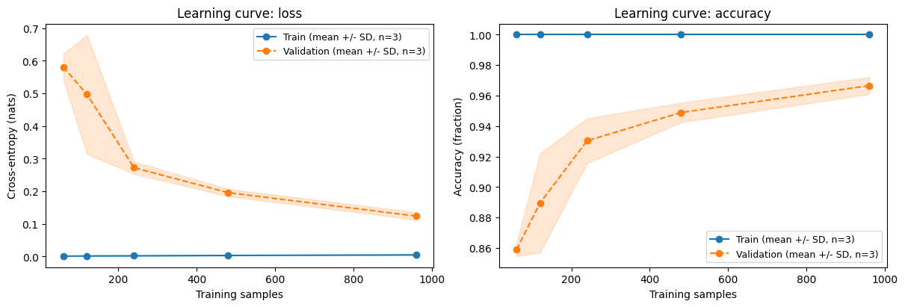
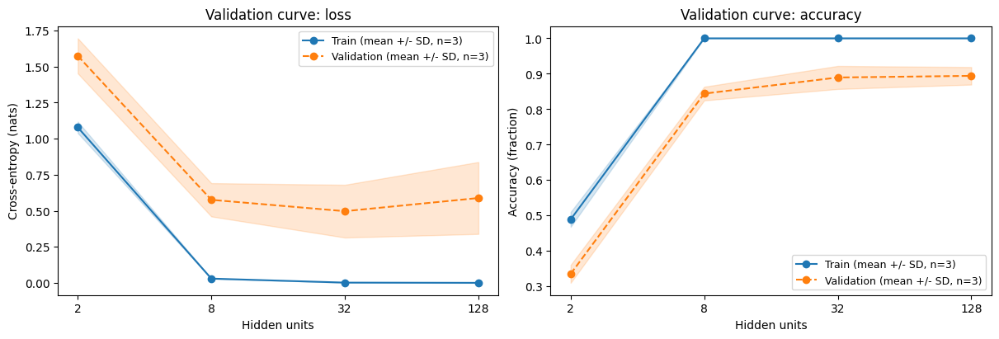
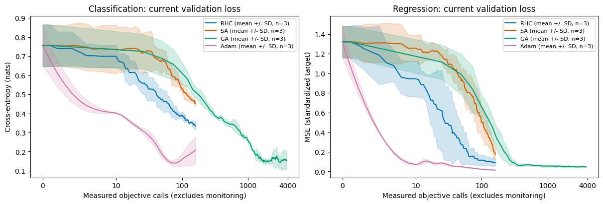

# Plotting and notebook implementation evidence

## Final notebook release pass

This section is the authoritative notebook evidence for the 2026-09-12 release
pass. The plotting implementation milestone below is retained as historical
context and does not describe the current notebook sequence.

The four notebooks were executed in filename order with the repository runner,
which starts a fresh kernel for each notebook and saves outputs only after a
successful run. The saved notebooks report Python 3.12.13 on macOS arm64 with
PyTorch 2.12.0, NumPy 2.2.6, Matplotlib 3.10.9, scikit-learn 1.7.2, and Optuna
4.8.0.

| Notebook | Code cells | Figure outputs | Computation and plotting |
| --- | ---: | ---: | ---: |
| 01 native training | 8 | 3 | 1.30 seconds |
| 02 optimizer comparison | 6 | 3 | 1.77 seconds |
| 03 training, learning, and validation curves | 6 | 3 | 1.32 seconds |
| 04 Optuna tuning | 8 | 2 | 1.49 seconds |
| Total | 28 | 11 | 5.88 seconds |

These are the timings printed by the notebooks from the start of computation
through final plotting. They exclude dependency imports and fresh-kernel startup,
so they are a reproducibility record for this machine rather than an end-to-end
runtime benchmark.

Commands and results for the final pass:

```bash
poetry install --extras notebooks
poetry run python scripts/execute_notebooks.py
poetry run ruff format --check .
poetry run ruff check .
poetry run pytest
poetry check
git diff --check
```

The notebook runner completed all 28 code cells in four independent fresh kernels,
saved 11 figures, and reported no cell errors. Ruff formatting and lint passed, all
91 tests passed, `poetry check` passed, and the final diff check passed. The saved
outputs were reviewed for readable labels, truthful units and interpretations,
uncertainty descriptions, and clipping.

The current outputs demonstrate the intended release changes. Native training
starts with a direct RHC optimizer replacement, then improves frozen-head validation
accuracy from 0.789 to 0.820 after restoring RHC's best state and to 0.842 after the
layer-specific hybrid workflow. The comparison uses a 0.2 SA initial temperature
and reports current loss, best loss, temperature, acceptance, optimizer calls, and
measured objective or fitness evaluations without treating unequal budgets as
equivalent. The curve workflow includes a training curve, selects width 32 from
validation evidence while leaving 360 test observations untouched, and keeps its
learning and validation claims tentative. The Optuna notebook retains the SA study,
adds a GA study and selected-configuration refit, and reports 89 GA generations and
364 fitness evaluations for the refit rather than equating the two counts.

## Historical plotting implementation milestone

The remainder records the earlier 2026-09-07 plotting implementation milestone.
Its notebook counts, timings, outputs, and validation results are non-authoritative
for the final release pass above.

Implemented on `fm/pyperch-plotting-notebooks` from the fetched remote default,
`origin/master` at `731af7729d453de07c415fe3b75d73fa7ac37073`. The isolated worktree
started clean and matched that remote commit. No default-branch merge or push was
performed. Optimizer implementation and optimizer tests have no changes. The
abandoned GA crossover experiment and held RHC reset-counter decision are excluded.

This is the implementation milestone for review before the separate no-mistakes
pipeline and PR delivery.

## Acceptance checklist

- [x] Removed the README agent-assisted-experiments blurb.
- [x] Added public `pyperch.plotting` preparation/rendering pairs for learning,
  training, and validation curves, independent of notebooks and estimator APIs.
- [x] Required explicit caller-owned Axes; every renderer returns the identical
  object and avoids figure creation, layout, resize, display, export, and close.
- [x] Kept preparation separate from rendering, with no fitting/training calls.
- [x] Documented structures, shapes, metrics, returns, terminology, ownership,
  repeat counts, seeds, and descriptive uncertainty.
- [x] Reviewed and cited the actual Dataquest learning-curves article and
  Yellowbrick validation-curve documentation.
- [x] Inventoried all ten prior example scripts and mapped them to four focused,
  independent executed notebooks. Kept freezing, hybrid updates, save/reload,
  classification, regression, optimizer comparisons, and native Optuna search.
- [x] Included actual learning, training, and validation curves with concepts and
  interpretation before and after the experiment and plotting cells.
- [x] Measured objective calls directly; reported monitoring separately and
  explained why backward work prevents compute equivalence with Adam.
- [x] Used repeated runs, sample-SD/range bands, and native Optuna history without
  duplicating Optuna diagnostics or adding unsupported importance estimates.
- [x] Saved actual outputs from clean kernels and visually inspected all ten
  figure outputs. Added descriptive image metadata for accessible HTML export.
- [x] Passed repository tests, lint/format, package checks, documentation link
  checks, HTML conversion, and standalone documentation-example execution.
- [x] Kept runtime changes confined to plotting and notebook execution support;
  inspected staged content for sensitive information and unrelated artifacts.

## API decisions

The [reference](plotting.md) owns the complete contract. Public functions live in
`pyperch.plotting`, with no new top-level exports. Three preparation functions
accept finite arrays with **points in rows and repeat runs in columns**. Frozen
`CurveData` and `CurveSeries` retain immutable summaries independent of source
arrays. Renderers accept only their matching prepared curve kind.

Means use equal repeat weights. Default bands are mean ± sample SD (`ddof=1`),
with observed range or no band as alternatives. One run never gets a band. Legends
state repeat counts and band meaning. Missing values, ragged or mismatched arrays,
duplicate numeric coordinates, invalid counts, and ambiguous categories are
rejected. Different optimizer grids can be overlaid with separate preparations;
there is no implicit alignment or invented evaluation count.

NumPy remains core. Matplotlib is a lazy optional rendering dependency under
`plotting`; `notebooks` adds the supported notebook UI/kernel/execution tools,
scikit-learn, widgets, and Optuna. Core imports continue to work with those optional
packages blocked, as verified in a fresh subprocess. Existing core dependency
versions were retained in the lockfile; its larger diff records optional notebook
dependencies and extra markers.

## Notebook progression and old-example coverage

The [archived migration map](https://github.com/jlm429/pyperch/blob/f6a76ede7dc8738c4dcdad07c17eed32e823343d/examples/README.md#complete-migration-map) lists
every original path and retained workflow. Ten scripts become four notebooks:

1. Native training, regression, digits save/reload, frozen features, and hybrid
   Adam/RHC updates. Hybrid cycles create a fresh RHC after each Adam update because
   the conditional objective changed; no reset-counter semantics are assumed.
2. RHC, SA, GA, and Adam comparisons on classification and regression, measured
   objective budgets, restored scores, and SA current/best/temperature/acceptance
   diagnostics. Per-run accuracy, F1, R², and loss appear in compact tables.
3. Learning curves at 60, 120, 240, 480, and 960 samples, followed by width validation
   curves at 2, 8, 32, and 128 units. Train and validation use paired repeat columns.
4. Eight exploratory native Optuna trials, repeated objectives, visible trial
   states, native search history, selected-parameter refit, and one test evaluation.

A dedicated diagnostics notebook would duplicate setup and separate diagnostics
from the questions they answer. Keeping them in notebooks 2 and 4 gives a clear
progression from training to evaluation, comparison, and selection. Smooth
run-distribution plots are omitted because showing all three observed runs is more
informative at this repeat count. No parameter-importance scope was added.

## Execution and validation

Validated on 2026-09-07 in the Poetry environment:

| Component | Version / setting |
| --- | --- |
| Python | 3.13.9 |
| Platform | macOS / Darwin arm64, CPU |
| PyTorch | 2.12.0; float32, one thread, deterministic operations |
| NumPy | 2.2.6 |
| Matplotlib | 3.10.9 |
| scikit-learn | 1.7.2 |
| Optuna | 4.8.0 |
| nbconvert / nbclient / ipykernel | 7.17.1 / 0.11.0 / 7.3.0 |

The implementation was validated before notebook experiments. The experiment
snapshot had the planned plotting/notebook/docs/dependency changes in progress,
but optimizer files were frozen throughout. Every notebook prints optimizer
SHA256 prefixes: `base.py cbb9801db916`, `rhc.py 5de8c194b8cd`,
`sa.py 100c5c2bab21`, and `ga.py 0356d61cd575`. These match the remote-default
baseline. The protocol, seeds, splits, initialization, loss, budget, and checkpoint
policy are stated before each experiment.

Commands used, from the repository root:

```bash
poetry install --extras notebooks
poetry run ruff format --check .
poetry run ruff check .
poetry run pytest
poetry check
poetry run python scripts/execute_notebooks.py --report .work/execution.json
poetry run jupyter nbconvert --to html --template classic \
  --output-dir .work/html examples/notebooks/*.ipynb
git diff --check
git diff --exit-code -- pyperch/optim tests/optim
```

Final fresh execution, including kernel startup, computation, and rendering:

| Notebook | Code cells | Figure outputs | Seconds |
| --- | ---: | ---: | ---: |
| 01 native training | 8 | 3 | 2.55 |
| 02 optimizer comparison | 6 | 3 | 3.72 |
| 03 learning and validation | 6 | 2 | 2.89 |
| 04 Optuna tuning | 6 | 2 | 2.48 |
| Total | 26 | 10 | 11.64 |

All code cells executed sequentially in fresh kernels, with no notebook stderr or
cell errors in the saved outputs. The first full execution took 30.89 seconds,
including cold startup. Users should budget a few minutes on other laptops and
allow extra time for dependency installation.

All **91 tests passed** (59 plotting contracts plus 32 existing tests). Tests cover
Axes identity/composition, preservation of caller figures and settings, forbidden
figure operations, shape/value validation, categories, repeated-run means and
bounds, single-run behavior, missing Matplotlib, and core-only preparation.
Ruff checks notebook code as well as Python modules. `poetry check` and diff checks
passed. Local Markdown/notebook links resolve. Four HTML exports contain ten
images with descriptive alt text and no conversion warnings. The documented
standalone composition example also ran successfully with caller PDF and SVG
exports to in-memory buffers.

During development, a small mixed-dtype NumPy matrix product emitted runtime
warnings on this machine; the visible toy target now uses its explicit linear
expression. Widgets resolve the notebook progress integration warning. Optuna's
experimental-visualization warning is retained as plain text without personal
paths. A trial IPC kernel transport change timed out before executing a notebook;
the final runner uses standard Jupyter fresh-kernel execution. The installed
ipykernel prints a generic local TCP transport warning to the runner terminal;
it is not a notebook computation failure and no transport override is shipped.

## Actual results and visual evidence

The saved regression example restores validation MSE **0.0486**, compared with
**3.3505** for its constant predictor. Digits RHC head refinement leaves validation
accuracy at **0.940**; the notebook explicitly reports the flat outcome. These are
workflow demonstrations, not optimizer superiority claims.

The learning experiment's mean validation accuracy increases from about **0.859**
at 60 samples to **0.967** at 960. The width sweep selects **32** by mean validation
cross-entropy (**0.4970**), with overlapping seed spread relative to larger width.
The eight Optuna trials all complete; trial 4 has mean validation loss **0.5549**.
Its independent seed-44 refit yields test cross-entropy **0.5458** and accuracy
**0.738**, a single final evaluation without a repeat band.

These images are extracted unchanged from actual executed notebook PNG outputs:







All ten output figures were visually reviewed for axes/units, legends, ribbon
meaning, margins, and clipping. The evaluation axis was changed to symlog so shorter
runs remain legible beside GA's measured budget; its nonlinear scale is explained
in Markdown. The native Optuna history y-label was shortened and wrapped to remove
clipping, and its styling is scoped to that figure. Remaining figures are embedded
in the linked notebooks. The browser wrapper's snapshot operation reported a
`pageId` argument error; visual review used the actual extracted rendered PNGs,
and HTML structure and image descriptions were checked separately.

## Sources and limits

Reviewed conceptual sources:
[Dataquest learning curves](https://www.dataquest.io/blog/learning-curves-machine-learning/)
and [Yellowbrick validation curves](https://www.scikit-yb.org/en/latest/api/model_selection/validation_curve.html).
Technical references:
[Matplotlib explicit interfaces](https://matplotlib.org/stable/users/explain/figure/api_interfaces.html),
[NumPy standard deviation](https://numpy.org/doc/stable/reference/generated/numpy.std.html),
[nbconvert execution](https://nbconvert.readthedocs.io/en/latest/execute.html),
[PyTorch state dictionaries](https://docs.pytorch.org/tutorials/beginner/saving_loading_models.html),
and [Optuna Matplotlib history](https://optuna.readthedocs.io/en/stable/reference/visualization/matplotlib/generated/optuna.visualization.matplotlib.optimization_history.html).

Three seeds and fixed small data splits provide descriptive teaching evidence,
not confidence intervals, tuned rankings, causal algorithm claims, or estimates
of performance across datasets. Evaluation counts exclude backward work and are
not elapsed-time equivalences. All execution evidence is CPU-only in the listed
Python environment; this milestone does not establish CUDA/MPS compatibility or
exercise every supported Python version. CI and PR delivery remain the subsequent
no-mistakes stage.
